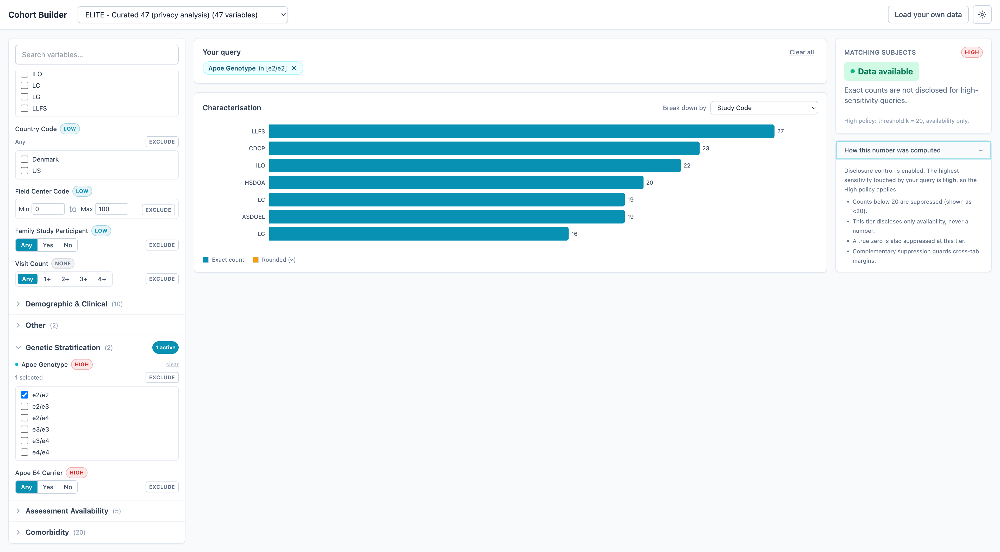

# Cohort Builder

A reusable, **client-side** cohort discovery tool. Researchers filter a cohort
on dozens of variables and see a live count of matching subjects, queried
entirely in the browser with **DuckDB-WASM** (no backend). For sensitive
variables a **statistical disclosure control (SDC)** layer suppresses counts
that are too small, while still honestly answering *"do we have any data?"*.

The whole app is driven by a single declarative **Cohort Spec**, so you can
point it at your own table by dropping in a data file (and an optional override
spec): the filter UI, the SQL query builder, and the SDC policy all reconfigure
with no code changes.



## Quick start

```bash
npm install
npm run dev          # http://localhost:5173
```

The app loads the bundled ELITE example dataset (25,000 synthetic subjects,
6,000 files) and is immediately usable. Other commands:

```bash
npm test             # 101 unit tests (SDC engine, spec inference/merge, query builder)
npm run typecheck    # tsc --noEmit
npm run build        # production build
```

## What you can do

- **Filter** on demographics, comorbidities, genetics, assessment availability,
  data modality, and study design.
- **Compose boolean queries** with a nested rule-group builder (powered by
  [react-querybuilder](https://react-querybuilder.js.org/), re-skinned in
  Tailwind):
  - Each group has a clear **AND / OR** toggle (OR within a group, AND across
    groups); add **nested groups** for mixed logic.
  - **NOT is a group property**: an **Exclude (NOT)** toggle negates a whole
    group (the research-backed "NOT is a place, not an operator" pattern).
  - Per-condition operators: **is any of** (IN/OR), **is all of** (file-level
    many-to-many: linked to files covering every value), **is none of**
    (NOT IN), **between** (range), **at least** (min count), **is** (boolean).
  - **Reorder/regroup** conditions by dragging, or with the keyboard-accessible
    ▲▼ move buttons (WCAG 2.2 SC 2.5.7 fallback).
  - A **plain-English read-back** echoes the query as a sentence.
  - Build it from the left **variable palette** (search + add) or edit inline.

  The interaction model follows the research in `docs/research/05-07`: operators
  are chosen by *structure* (where a condition sits), not from a per-row
  combinator dropdown.
- **See facet counts** next to every value, **conditional on your other active
  filters** (true faceted search) and passed through the SDC engine.
- **See a live count** that respects the disclosure policy: exact, rounded
  (`≈`), suppressed (`< k`), boolean-only ("Data available"), or true-zero.
- **Characterise** the cohort with **multiple add/removable chart panels**
  (seeded from the spec's `defaultCharts`) that hatch out suppressed cells
  rather than inventing numbers.
- **Browse the data files** for the current cohort in a paginated table: one row
  per file (`syn` ID + metadata) with a disclosure-controlled count of matching
  subjects.
- **Tune the SDC policy** at runtime (Settings gear): per-sensitivity-level
  threshold `k`, rounding, complementary suppression, boolean-only, plus global
  query-set-size and repetition guards.
- **Switch datasets** (4 example specs compiled from the ELITE workbook) or
  **load your own** data file + optional override spec.

### Default charts per spec

Each spec can declare `defaultCharts` (a list of variable names) that seed the
characterisation panels on load. The bundled examples use: ELITE-47 → Study
Code, v2.0 → Consortium, v3.0 → Cohort, AD v1.0 → Cohort. Users can add or
remove panels at runtime.

## Statistical disclosure control

Every count and every cross-tab cell passes through the SDC engine
(`src/sdc/`). Treatment is keyed on the **most sensitive variable** touched by
the query. Defaults:

| Sensitivity | threshold `k` | rounding | complementary | boolean-only |
|---|---|---|---|---|
| None | 1 | none | no | no |
| Low | 5 | nearest 5 | no | no |
| Medium | 10 | up to 10 | yes | no |
| High | 20 | up to 20 | yes | **yes** |

Algorithm order (load-bearing): zero-check → boolean mode → primary suppression
→ rounding → recompute totals → complementary pass on cross-tabs. Random
rounding is deterministic per canonical query string, so repeating a query
cannot average the noise away. See
[`docs/research/02-statistical-disclosure-control.md`](docs/research/02-statistical-disclosure-control.md).

### Honesty rules

- A **suppressed** cell is never shown as a number, and is visually distinct
  from a **true zero**.
- **High-sensitivity** queries return only "Data available" / "Insufficient
  data" by default (overridable in Settings).
- The "How this number was computed" panel always states which policy was
  applied.

### Limitation: client-side controls are advisory

All SDC and differencing guards run **in the browser and are therefore
bypassable**. This POC demonstrates the *policy and the UX*, not a hardened
privacy boundary. A production deployment must enforce SDC and query
restrictions **server-side** (query-set-size limits, per-user repetition limits,
an auditable query log). The client guards here are best-effort and clearly
labelled as such.

## The Cohort Spec (reusability)

The app is configured by one declarative spec. A spec is produced by:

1. **Inference** from the data file's schema + value sampling (zero config):
   widget from column type + cardinality, category and sensitivity from a
   keyword heuristic, entity from the table, relationships from junction tables.
2. **Override** (optional, YAML / TOML / JSON): correct sensitivity levels, pick
   widgets, supply controlled vocabularies, declare many-to-many relationships,
   tune the SDC policy. Overrides deep-merge over the inferred base
   (variables matched by column).

Format reference: [`docs/spec-format.md`](docs/spec-format.md). Types:
`src/spec/types.ts`.

### Bring your own table

Click **Load your own data** and provide:

- a `subjects` file (Parquet or CSV) — required;
- optionally a `files` table and a `subject_files` junction (for many-to-many
  file filters);
- optionally an override spec (`.yaml` / `.toml` / `.json`).

With no override, the app infers everything and applies heuristic SDC. The
override only corrects what the heuristic gets wrong.

## Example datasets

Compiled from the sheets of `Cohort Builder output privacy analysis.xlsx`
(`scripts/compile_specs.py`) and backed by synthetic data
(`scripts/generate_data.py`):

| Spec | Variables | Notes |
|---|---|---|
| ELITE - Curated 47 | 47 | The privacy-analysis sheet with full sensitivity metadata; rich correlated data (25k subjects / 6k files). |
| ELITE - v2.0 Full | 121 | Full harmonisation library; sensitivity from the sheet's rank column. |
| ELITE - v3.0 Refined | 84 | Refined library. |
| AD Knowledge Portal v1.0 | 50 | No sensitivity tagging in the sheet, so it defaults to Low: demonstrates inference + heuristic SDC. |

## Synthetic data

All data is **synthetic** and represents no real person. The generator
(`scripts/generate_data.py`, seed 42) produces plausible, **correlated** data:
age right-skewed (mean ~74), realistic comorbidity prevalences (hypertension
~70%, diabetes ~28%, ...) driven by a shared latent burden score, APOE
genotypes via Hardy-Weinberg, and a genuine many-to-many subject<->file mapping
(per-sample files link to one subject; cohort-level files link to thousands).
Each file has a Synapse-style ID matching `^syn[0-9]{6,9}$`.

Regenerate:

```bash
python3 scripts/generate_data.py elite                                  # the 25k/6k ELITE set
python3 scripts/generate_data.py from-spec public/specs/ad-v1.spec.json --subjects 4000 --out public/data/ad-v1/
python3 scripts/compile_specs.py                                        # rebuild specs from the xlsx
```

## Architecture

```
data file(s) ──► DuckDB-WASM ──► introspect ──► inferSpec ──┐
                  (src/duckdb)    (loader)      (src/spec)   │
                                                             ├─► mergeSpec ─► effective CohortSpec
override (yaml/toml/json) ──► parseOverride ─────────────────┘                      │
                                                                                    ▼
                       filter state ──► query builder (src/query) ──► SQL ──► DuckDB ──► raw count
                                                                                    │
                                                          SDC engine (src/sdc) ◄─────┘
                                                                    │
                                                          honest count / cross-tab ──► UI (src/components)
```

| Path | Responsibility |
|---|---|
| `src/spec/` | Spec types, inference, override parse + merge, resolution pipeline |
| `src/duckdb/` | DuckDB-WASM singleton, data loading, schema introspection |
| `src/query/` | Filter-state model + type-aware SQL compilation (incl. junction subqueries) |
| `src/sdc/` | Disclosure-control engine: suppression, rounding, complementary, guards |
| `src/app/` | App-state context (`useApp`) wiring everything together; shell |
| `src/components/` | Filter panel, query summary, count rail, characterisation, settings, uploader |
| `scripts/` | `generate_data.py`, `compile_specs.py` |
| `docs/research/` | Research reports + the decisions/architecture synthesis (`00-...`) |

## Deployment (GitHub Pages)

This repo deploys to GitHub Pages via `.github/workflows/deploy.yml` (build with
Node, then `actions/deploy-pages`). The Vite `base` is `/cohort-builder/` for
production builds, so the site is served at:

```
https://<user>.github.io/cohort-builder/
```

To deploy:

1. Push to `main` on a repo named `cohort-builder`.
2. In the repo, **Settings → Pages → Build and deployment → Source = GitHub
   Actions** (the workflow handles the rest).
3. The workflow builds and publishes `dist/`; the first run takes a few minutes.

If you rename the repo, set the base accordingly at build time:
`VITE_BASE=/your-repo-name/ npm run build` (the workflow reads `VITE_BASE`). For
a user/organisation site (`<user>.github.io`) served at the root, use
`VITE_BASE=/`.

All runtime asset URLs are resolved through `src/util/asset.ts`
(`import.meta.env.BASE_URL`), so the app works both at the root in dev and under
the sub-path in production.

## Privacy

Everything runs client-side. When you "load your own data", files are read in
the browser and registered into DuckDB-WASM in memory; **nothing is uploaded to
a server and nothing is persisted** after the tab closes. On a static host such
as GitHub Pages there is no backend that could receive it. Note that, because
all computation is client-side, the disclosure controls are advisory UX, not a
server-enforced privacy boundary (see "Limitation" above).

## Notes

- Pinned `@duckdb/duckdb-wasm@1.32.0`; bundles are self-hosted via Vite `?url`
  imports (single-threaded `eh` bundle, no cross-origin-isolation headers
  needed at this scale).
- British English throughout. Built with React 18 + Vite + TypeScript +
  Tailwind + recharts.
